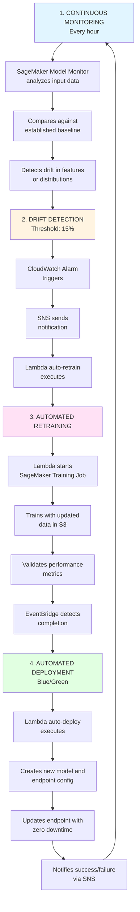

# Salesforce Lead Scoring Platform with MLflow & FastAPI

Welcome to Salesforce production-ready  lead scoring platform (1-5 scale) with MLflow model registry and FastAPI microservice architecture.

By José Manuel Martinez


| Version  | Sonnar Cloud               | Snyk Status               | Apiiro Status         | Runtime version   | Deployment Status  |
|-----------------|----------------------------| --------------------------|-----------------------|-------------------|--------------------|
| v 0.1 | [](https://sonarcloud.io/summary/new_code?id=salesforce_scoring-leads_tools) [](https://sonarcloud.io/summary/new_code?id=salesforce_scoring-leads_tools) [](https://sonarcloud.io/summary/new_code?id=salesforce_scoring-leads_tools) [](https://sonarcloud.io/summary/new_code?id=salesforce_scoring-leads_tools) | <a href="https://app.snyk.io/org/analytics-pui/reporting?context[page]=issues-detail&project_target=%255B%2522salesforce%252Fscoring-leads%2522%255D&project_origin=%255B%2522github%2522%255D&issue_status=%255B%2522Open%2522%255D&issue_by=Severity&table_issues_detail_cols=SEVERITY%257CSCORE%257CCVE%257CCWE%257CPROJECT%257CEXPLOIT%2520MATURITY%257CCOMPUTED%2520FIXABILITY%257CINTRODUCED%257CSNYK%2520PRODUCT&v=1" style="margin-lef: 10px;">  </a> | <a href="https://app.apiiro.com/profiles/repositories/c362b963-c839-4fdb-9533-2a9239783ff6/" style="margin-lef: 10px;">  </a> |  | [](https://github.com/salesforce/scoring-leads/actions/workflows/cd_scoring_leads_engine.yml) |


# Table of Contents

## 🏗️ Architecture
Architecture diagram of deployed solution in AWS
> **Nota:** The infrastructure will be shut down until the day of the presentation to avoid charges while not in use.


```
┌─────────────────────────────────────────────────────────────┐
│                         Amazon API Gateway                  │_______________ AWS Cloudwatch
│                    Auth handler & API publishing            │
└─────────────────────────────────────┬───────────────────────┘
                                      │
                                      │
┌─────────────────────────────────────────────────────────────┐
│                         Amazon EKS (Port 80)                │
│                    Reverse Proxy & Load Balancer            │
└─────────────┬───────────────────────┬───────────────────────┘
              │                       │
              │                       │
    ┌─────────▼─────────┐   ┌─────── ─▼─────────┐
    │   FastAPI API     │   │   MLflow Server   │
    │   (Port 8000)     │   │   (Port 5000)     │────AWS S3 (Artifacts store)
    │                   │───│                   │
    │ • Lead Scoring    │   │ • Model Registry  │────AWS RDS (MLFlow backed store)
    │ • Model Loading   │───│ • Experiment      │─────────────────────────────────────── AWS Secrets Manager
    │ • Predictions     │   │   Tracking        │
    └─────────┬─────────┘   └───────────────────┘
              │                      
              │                      
    ┌─────────▼────────────────────────────────┐
    │                                          │
    │         SnowflakeDB (Port 5432)          │
    │         MLflow Metadata Store            │
    │                                          │
    └──────────────────────────────────────────┘
 
```

## 📋 Prerequisites

- Docker Engine 20.10+
- Docker Compose 2.0+
- 4GB RAM minimum
- 10GB disk space

## 🚀 Development procedure
### I : Model
#### 1.1. Training Scripts

```bash
sagemaker_train.py - Model adaptation for SageMaker
sagemaker_inference.py - Endpoint inference handler
```

#### 1.2. Deployment Management

```
sagemaker_deployment.py - Class for training and deploying salesforce XGBoost model
Support for blue/green deployments
Zero downtime endpoint updates
```
#### 1.3. Monitoring and Drift Detection
```
sagemaker_model_monitor.py - Continuous monitoring system
Automatic drift detection with configurable thresholds
Complete automatic retraining pipeline
```

#### 1.3.4 Infrastructure as Code

```
terraform_infrastructure.tf provide definitions for all platform coomponents
```

Witth this implementation, the training and monitoring flow works as follows:



## 🚀 Running the platform


### 1. Clone and Setup

```bash
# Create project structure
mkdir salesforce-lead-scoring-platform
cd salesforce-lead-scoring-platform

# Create directories
git clone git@github.com:J0MS/reimagined-fishstick-salesforce-exec.git
```

### 2. Environment Configuration

```bash
# Copy environment template
cp .env.example .env

```

### 3. Running

**Running app**
```bash
docker-compose build && docker-compose up api 
```

**Running unit test**
```bash
docker-compose build --build-arg JFROG_CONNECTION_STRING && docker-compose up api_unit_test 
```


Aditionally, check Swagger documentation on ```bash http://0.0.0.0:8000/docs```


### Making Predictions

```bash
# Single prediction
curl -X 'POST' \
  'http://0.0.0.0:8000/v1.0/compute' \
  -H 'accept: application/json' \
  -H 'Content-Type: application/json' \
  -d '{
  "LEAD_ID": 0,
  "MARKET": "string",
  "INFERENCE_PARAMETERS": {
    "annual_revenue": 5000000,
    "case_study_views": 2,
    "company_size": 500,
    "content_downloads": 3,
    "days_since_last_activity": 2.5,
    "demo_requested": 1,
    "email_clicks": 5,
    "email_opens": 10,
    "is_decision_maker": 1,
    "job_level_score": 4,
    "page_views": 25,
    "pages_per_session": 5,
    "pricing_page_visits": 4,
    "return_visitor": 1,
    "session_duration_avg": 8.5
  }
}
```


## 🔄 Model Deployment Workflow

### 1. Train Model
```bash
# Train and register model in MLflow
make train
```

### 2. View in MLflow UI
- Navigate to http://localhost:5000
- View experiments, runs, and metrics
- Check model in registry

### 3. Promote to Production
```bash
# Promote specific version to Production
```

### 4. Reload in API
```bash
# API will automatically load new production model
```

### 5. Verify
```bash
# Check model info
```

## 📊 Monitoring & Observability

### View Logs
```bash
# All services
docker-compose logs -f

# Specific service
docker-compose logs -f api
docker-compose logs -f mlflow-server
```

## 🎯 Next Steps

- [ ] Add authentication & authorization
- [ ] Implement model A/B testing
- [ ] Add K8S metrics
- [ ] Set up complete CI/CD pipeline
- [ ] Add model drift detection
- [ ] Implement feature store
- [ ] Complete Kubernetes deployment configs
- [ ] Complete Unit & Integration test
- [ ] Set up sonnar cloud analysis

